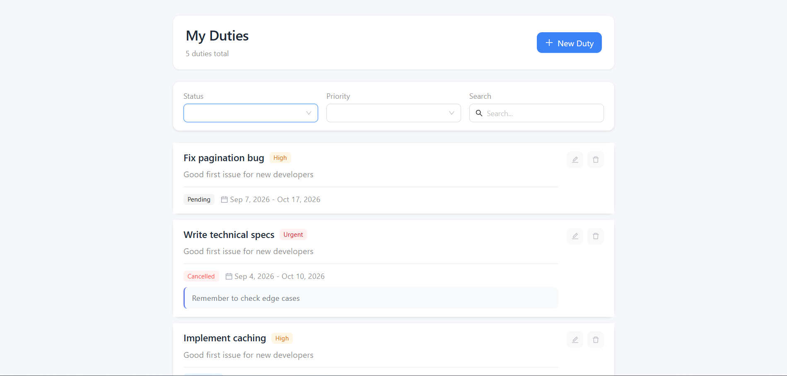
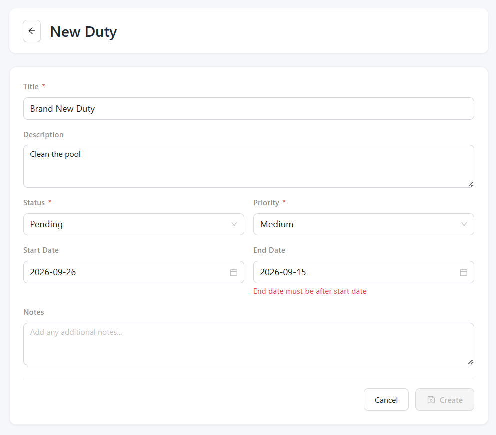
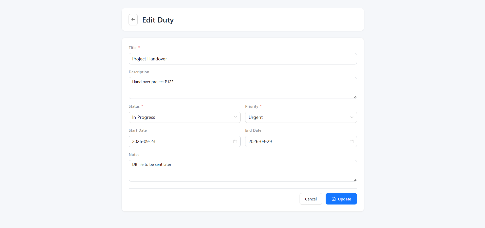
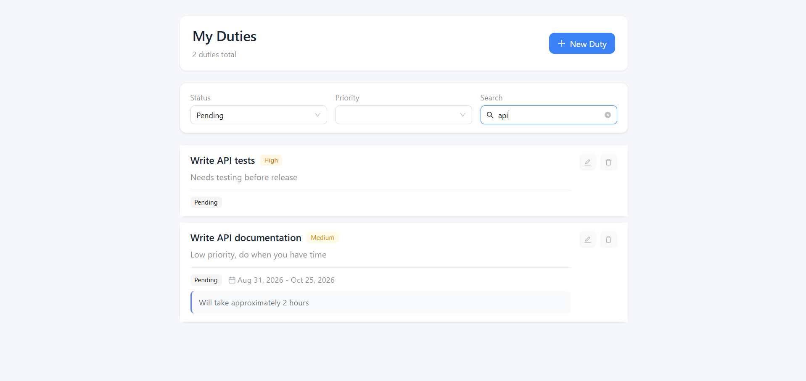

# TODO App - Frontend

React + Vite + TypeScript frontend for duty/task management.

## Requirements

- **Node.js** >= 18.x
- **Backend** must be running at `http://localhost:3000` (or configure via API_BASE_URL)

## Quick Start

```bash
# 1. Install dependencies
npm install

# 2. Start development server
npm run dev

# Open http://localhost:5173 in your browser
```

## Commands

| Command | Description |
|---------|-------------|
| `npm run dev` | Run in development mode (Vite) |
| `npm run build` | Build for production |
| `npm run preview` | Preview production build locally |
| `npm test` | Run Jest tests |

## Environment Variables

Create a `.env` file in the `src/frontend` directory:

```env
# Backend API URL (default: http://localhost:3000)
VITE_API_BASE_URL=http://localhost:3000
```

## Screenshots

### 1. Duty List


### 2. Create New Duty


### 3. Edit Duty


### 4. Filters


## Features

- ✅ **View duties** - Paginated list with status indicators
- ✅ **Create duty** - Form with validation
- ✅ **Edit duty** - Inline editing with form modal
- ✅ **Delete duty** - Soft delete with confirmation
- ✅ **Filter by status** - pending, in_progress, completed, cancelled
- ✅ **Filter by priority** - low, medium, high, urgent
- ✅ **Search** - Real-time search by title/description
- ✅ **Pagination** - Navigate through pages

## Project Structure

```
src/
├── components/           # Reusable UI components
│   ├── DutyList/       # Main duty list component
│   ├── DutyItem/       # Individual duty item
│   └── Header/         # App header
├── pages/              # Page components
│   ├── HomePage/       # Main duty list page
│   └── DutyFormPage/  # Create/Edit duty form
├── services/           # API calls
│   ├── apiClient.ts    # Axios instance with interceptors
│   └── dutyService.ts  # Duty CRUD operations
├── types/              # TypeScript types
│   └── duty.ts        # Duty interface
├── config/             # App configuration
│   └── api.ts         # API config
├── App.tsx             # Root component
├── main.tsx           # Entry point
└── index.css          # Global styles
```

## Tech Stack

- **React 18** - UI library
- **Vite** - Build tool
- **TypeScript** - Type safety
- **Ant Design** - Component library
- **Axios** - HTTP client
- **React Router** - Routing
- **Jest** - Testing

## Testing

```bash
npm test
```

Tests cover:
- API service layer
- React components (rendering, interactions)
- Form validation

## API Integration

The frontend communicates with the backend API:

| Method | Endpoint | Description |
|--------|----------|-------------|
| GET | /api/duties | List duties (paginated) |
| GET | /api/duties/:id | Get single duty |
| POST | /api/duties | Create duty |
| PUT | /api/duties/:id | Update duty |
| DELETE | /api/duties/:id | Delete duty |

See [Backend README](../backend/README.md) for full API documentation.
